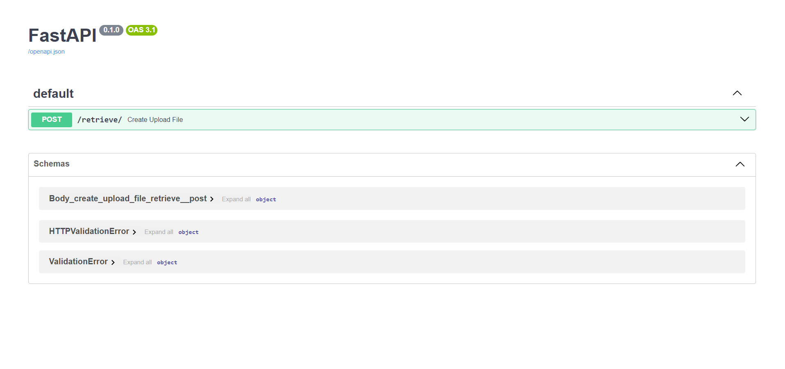

# Question Answering from PDF/JSON based reference files based on RAG using Langchain
This is simple implementation of RAG using langchain and OpenAI. Here the API accepts 2 files for list of questions(JSON) and a reference file (PDF or JSON) which contains relevant context for answer. The response is in format ```json{question1: answer1, question2: answer2}```

# Python 3 Version
Recommended and used python version is `Python 3.11.4`

# Setup Steps (Ubuntu)
1. Create virtual environment
    - `python3 -m venv env`
2. Activate virtual environment
    - `source env/bin/activate`
3. Create .env file at project root from .env.example file.
4. Set OPENAI_API_KEY variable in .env file
5. Install required python packages
    - `pip install -r requirements.txt`
6. Run server
    - `fastapi run`

# API docs
Swagger: http://localhost:8000/docs


Redoc: http://localhost:8000/redoc


# Sample Input Responses
## Sample Imputs
Sample Imput pairs are provided in `sample_input` directory
- Sample 1 (PDF reference):
    - questions_json_file: `llama2-questions.json`
    - reference_file: `llama2.pdf`
- Sample2 (JSon reference):
    - questions_json_file: `fb-chat-questions.json`
    - reference_file: `fb-chat.json`

### Note:
The JSON File content is extracted from `.messages[].content` field. So, Always include this field in input file.

## Sample Responses
### Sample 1
```json
{
    "describe performance of LLAMA2 against other models": "Llama 2 has demonstrated competitive performance against existing open-source models and is comparable to some proprietary models like GPT-3.5 on evaluation sets such as MMLU and GSM8K. Specifically, Llama 2 70B outperforms Llama 1 models and also surpasses MPT models in most categories, except for code benchmarks. Overall, Llama 2 models generally excel in helpfulness and safety benchmarks compared to other open-source models.",
  "what is safety in LLM?": "Safety in large language models (LLMs) refers to the measures and methodologies implemented to reduce the risk of harmful outputs, such as biased or unsafe content. This involves analyzing pretraining data, aligning models for safety through techniques like supervised fine-tuning (SFT) and reinforcement learning from human feedback (RLHF), and evaluating the model's behavior across different demographic groups. The goal is to ensure responsible development and deployment of LLMs while maintaining their helpfulness."
}
```

### Sample 2
```json
{
  "What is this conversation all about?": "The conversation seems to revolve around a simple exchange of farewells, indicated by the repeated use of \"Bye!\" Additionally, there's a question about how much someone wants, but without further context, it's unclear what is being referred to. Overall, the interaction appears to be casual and lacks depth.",
  "Summerize the conversation": "The conversation consists of repeated exchanges of the word \"Bye!\" indicating a farewell between participants. There are no additional details or context provided, making it a straightforward goodbye interaction."
}
```
